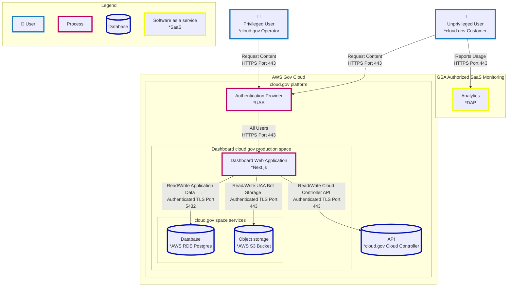

```mermaid
flowchart TB
  direction BT
  %% Styles
  classDef userStyle stroke:#167CC5,stroke-width:4px
  classDef processStyle stroke:#bc0061,stroke-width:4px
  classDef saasStyle stroke:#f2ff07,stroke-width:4px
  classDef dbStyle stroke:#010daf,stroke-width:4px

  %% Component Defintions

  %% Users
  user_privleged["👤  <br/> Privileged User <br/> *cloud.gov Operator"]:::userStyle
  user_unprivleged["👤  <br/> Unprivileged User <br/> *cloud.gov Customer"]:::userStyle

  %% SaaS
  dap[Analytics <br/> *DAP]:::saasStyle

  %% Processors
  auth_provider[Authentication Provider <br/> *UAA]:::processStyle
  dashboard_app[Dashboard Web Application <br/> *Next.js]:::processStyle

  %% Databases
  database[(Database <br/> *AWS RDS Postgres)]:::dbStyle
  api[(API <br /> *cloud.gov Cloud Controller)]:::dbStyle
  s3_bucket[(Object storage<br/> *AWS S3 Bucket)]:::dbStyle

  %% Flow
  auth_provider -- All Users <br/> HTTPS Port 443 --> dashboard_app

  user_unprivleged -- Request Content <br/> HTTPS Port 443 --> auth_provider
  user_privleged -- Request Content <br/> HTTPS Port 443 --> auth_provider
  user_unprivleged -- Reports Usage <br/> HTTPS Port 443 --> dap

  dashboard_app -- Read/Write Application Data <br /> Authenticated TLS Port 5432  --> database
  dashboard_app -- Read/Write UAA Bot Storage <br /> Authenticated TLS Port 443  --> s3_bucket
  dashboard_app -- Read/Write Cloud Controller API <br /> Authenticated TLS Port 443 --> api

  %% Layout
  subgraph GSA Authorized SaaS Monitoring
    dap
  end

  subgraph AWS Gov Cloud
    subgraph cloud.gov platform
      auth_provider
      subgraph Dashboard cloud.gov production space
        dashboard_app
        subgraph cloud.gov space services
          database
          s3_bucket
        end
      end
      api
    end
  end

  subgraph Legend
    direction BT
    legend_user["👤 User"]:::userStyle
    legend_process[Process]:::processStyle
    legend_db[(Database)]:::dbStyle
    legend_saas[Software as a service <br/> *SaaS]:::saasStyle
  end
```
